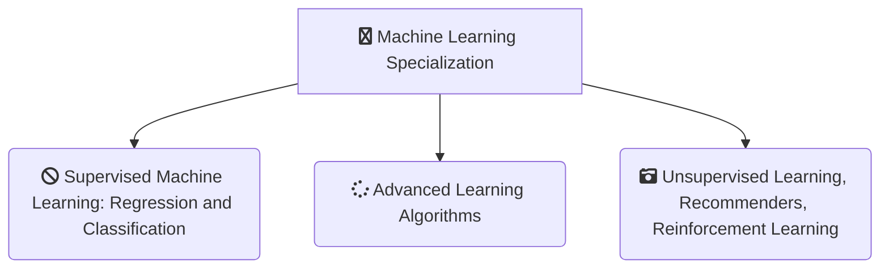

<h1 align="center">
  Machine Learning Specialization (Stanford)
</h1>
 

### Table of contents
- [Curriculum](https://github.com/jmcheon/machine_learning_specialization/wiki/Curriculum)
  - [Course1 - Supervised Machine Learning: Regression and Classification](https://github.com/jmcheon/machine_learning_specialization/tree/main/Course1) (3 Modules)
  - [Course2 - Advanced Learning Algorithms](https://github.com/jmcheon/machine_learning_specialization/tree/main/Course2) (4 Modules)
  - [Course3 - Unsupervised Learning, Recommenders, Reinforcement Learning](https://github.com/jmcheon/machine_learning_specialization/tree/main/Course3) (3 Modules)

## About this Specialization

### Course1 - Supervised Machine Learning: Regression and Classification

- Module1 - Introduction to Machine Learning
- Module2 - Regeression with multiple input variables
- Module3 - Classification

### Course2 - Advanced Learning Algorithms

- Module1 - Neural Networks
- Module2 - Neural Network training
- Module3 - Advice for applying machine learning
- Module4 - Decision trees

### Course3 - Unsupervised Learning, Recommenders, Reinforcement Learning

- Module1 - Unsupervised learning
- Module2 - Recommender systems
- Module3 - Reinforcement learning

## Certificates

[Machine Learning Specialization](https://coursera.org/share/83906f9565be764bc95ef2ed1f1d7a5a) (Mar 3, 2025)

- [Course1 - Supervised Machine Learning: Regression and Classification](https://www.coursera.org/account/accomplishments/certificate/LLUBYPFVYT5B) (Jul 25, 2023)
- [Course2 - Advanced Learning Algorithms](https://www.coursera.org/account/accomplishments/certificate/VQ5ZHV87ZDUZ) (Jan 3, 2024)
- [Course3 - Unsupervised Learning, Recommenders, Reinforcement Learning](https://www.coursera.org/account/accomplishments/certificate/853BNYM8PSYC) (Mar 3, 2025)

## References

[Machine Learning Specialization](https://www.coursera.org/specializations/machine-learning-introduction)
